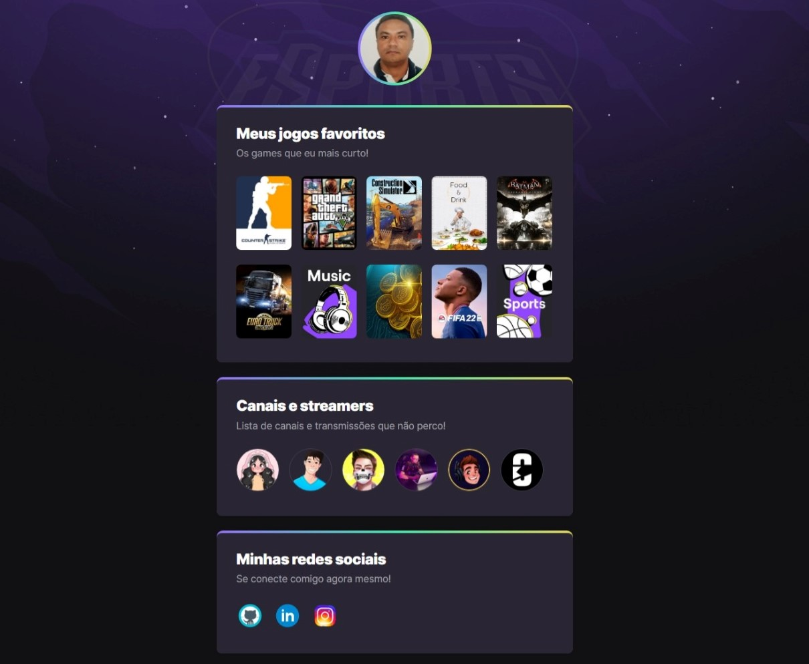

# Projeto NLW eSports.

Projeto construído no evento Next Level Week da Rocketseat. 
Um site centralizador de links, no estilo Linktree, feito especialmente para gamers 
utilizarem na Twitch e outras redes sociais com a proposta de compartilhar quais games e canais acompanham.

[🔗 Clique aqui para acessar](https://marcos-franco.github.io/Nlw-Esports/Nlw-Esports/)

## 🛠 Tecnologias

- HTML
- CSS
- Git
- Github

## 💛 Contatos:

Linkedin: https://www.linkedin.com/in/marcosfranco-5b1a8a111/

Github: https://github.com/marcos-franco

WhatSapp: https://contate.me/marcos-franco

E-mail: masf68@hotmail.com
