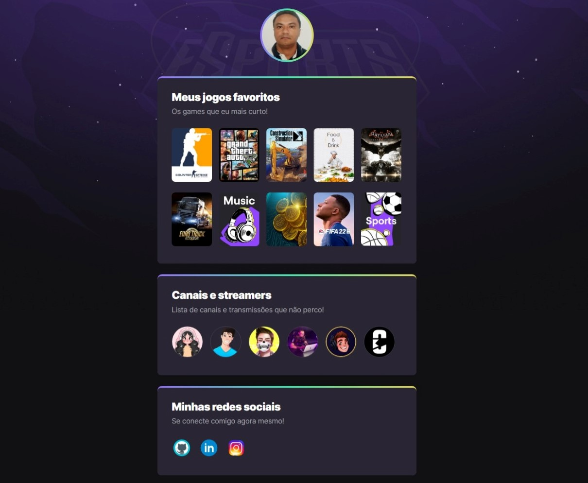

# NLW eSports

## Descrição:
Projeto construído do evento Next Level Week da Rocketseat.
Canais e Streamers, minhas redes sociais e meus jogos favoritos.

[🔗 Clique aqui para acessar](https://marcos-franco.github.io/Nlw-Esports/)

## 🛠 Tecnologias:
- HTML
- CSS
- Javascript
- Consumo de API
- Git
- Github

## Status do Projeto:
100% Concluído

## Autor:
Projeto desenvolvido por [Marcos Franco](https://www.linkedin.com/in/marcosfranco-5b1a8a111/)

## 💛 Contatos:

Linkedin: https://www.linkedin.com/in/marcosfranco-5b1a8a111/

Github: https://github.com/marcos-franco

WhatSapp: https://contate.me/marcos-franco

E-mail: masf68@hotmail.com
